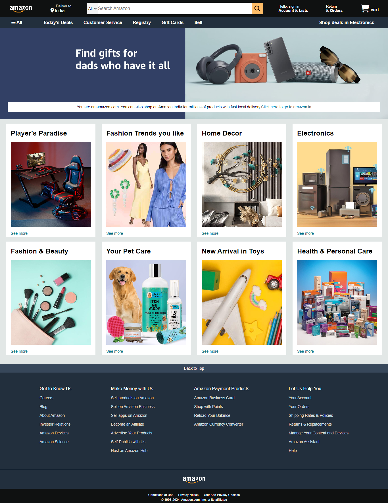

# Amazon-LandingPage-Clone
This project is a clone of the Amazon landing page. It aims to replicate the look and feel of the Amazon homepage.

It was built as a practice exercise to enhance web development skills, particularly in HTML and CSS.

# Technologies Used
  * HTML
  * CSS

## Screenshots

# Deployment
Application live at [Amazon](https://kapadiya-gaurav.github.io/Amazon-LandingPage-Clone/).

